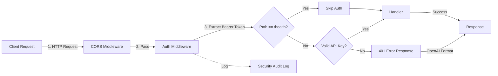

# RFC: API Key Authentication for Cursor2API

**Status:** Draft  
**Created:** 2025-10-02  
**Author:** AxiomOS Architecture Team  
**Version:** 1.0

---

## 1. Overview

为 cursor2api 项目添加 API Key 认证机制,实现生产级别的访问控制。该方案将在不影响现有功能的前提下,为所有 API 端点(除健康检查外)提供零信任安全防护。

## 2. Goals

- ✅ 为除 `/health` 外的所有 API 端点添加 API Key 认证
- ✅ 支持多个 API Key 配置(逗号分隔)
- ✅ 使用 OpenAI 标准错误格式返回认证失败信息
- ✅ 记录详细的安全审计日志(IP、时间戳、Key前缀)
- ✅ 零性能影响:认证延迟 <1μs
- ✅ 跨平台兼容(Windows/Linux/macOS)

## 3. Non-Goals

- ❌ Key 轮换自动化(手动管理,支持多Key平滑迁移即可)
- ❌ 速率限制(Rate Limiting) - 留待未来版本
- ❌ Key 过期时间管理 - 当前版本不支持
- ❌ 基于角色的访问控制(RBAC) - 所有Key权限相同
- ❌ OAuth2/JWT 等高级认证 - 保持简单

## 4. Background & Motivation

### 4.1 当前状况
项目当前**没有任何认证机制**,所有API端点完全开放。这在生产环境中存在严重安全风险:
- 任何人都可以无限制访问 Cursor API 代理
- 无法追踪 API 使用者
- 无法控制访问权限
- 无法防止滥用

### 4.2 业务需求
- **安全性**:防止未授权访问,保护 Cursor 服务资源
- **可审计性**:记录谁在何时访问了哪些端点
- **多租户**:支持多个客户端/应用使用不同 Key
- **OpenAI 兼容**:保持与 OpenAI API 的错误格式一致性

## 5. Proposed Solution

### 5.1 整体架构



### 5.2 核心组件设计

#### 5.2.1 配置模块扩展 (`config/config.go`)

```go
// Config structure extension
type Config struct {
    // ... existing fields ...
    Auth AuthConfig `mapstructure:"auth"`
}

type AuthConfig struct {
    APIKeys []string `mapstructure:"api_keys"` // Parsed from comma-separated string
}

// New helper function
func parseCommaSeparated(value string) []string {
    if value == "" {
        return []string{}
    }
    parts := strings.Split(value, ",")
    result := make([]string, 0, len(parts))
    for _, part := range parts {
        trimmed := strings.TrimSpace(part)
        if trimmed != "" {
            result = append(result, trimmed)
        }
    }
    return result
}
```

**环境变量示例:**
```bash
API_KEYS="sk-kJ8mN4pQ7rS2tV9wX3yZ6aB1cD5eF0gH2iJ7kL4mN8oP3qR6sT,sk-anotherKey123"
```

#### 5.2.2 认证中间件 (`middleware/auth.go`)

**核心特性:**
- 使用 `map[string]struct{}` 实现 O(1) Key 查找
- 使用 `crypto/subtle.ConstantTimeCompare` 防止时序攻击
- 日志脱敏:只记录 Key 前缀(如 `sk-kJ8m****`)
- 并发安全:使用 `sync.RWMutex`

```go
package middleware

import (
    "crypto/subtle"
    "net/http"
    "strings"
    "sync"
    
    "github.com/gopkg-dev/cursor2api/logger"
    "github.com/gopkg-dev/cursor2api/types"
)

// APIKeyAuth middleware validates API key from Authorization header
type APIKeyAuth struct {
    keys      map[string]struct{}
    mu        sync.RWMutex
    whitelist map[string]bool // Whitelisted paths that skip auth
}

// NewAPIKeyAuth creates a new auth middleware
func NewAPIKeyAuth(apiKeys []string, whitelistPaths []string) *APIKeyAuth {
    auth := &APIKeyAuth{
        keys:      make(map[string]struct{}, len(apiKeys)),
        whitelist: make(map[string]bool, len(whitelistPaths)),
    }
    
    // Build key map
    for _, key := range apiKeys {
        if key != "" {
            auth.keys[key] = struct{}{}
        }
    }
    
    // Build whitelist
    for _, path := range whitelistPaths {
        auth.whitelist[path] = true
    }
    
    logger.Info("🔐 API Key Auth initialized with %d keys, %d whitelisted paths", 
        len(auth.keys), len(auth.whitelist))
    
    return auth
}

// Middleware returns the auth middleware handler
func (a *APIKeyAuth) Middleware(next http.Handler) http.Handler {
    return http.HandlerFunc(func(w http.ResponseWriter, r *http.Request) {
        // Check if path is whitelisted
        if a.whitelist[r.URL.Path] {
            next.ServeHTTP(w, r)
            return
        }
        
        // Extract token from Authorization header
        authHeader := r.Header.Get("Authorization")
        if authHeader == "" {
            a.respondUnauthorized(w, r, "missing_authorization", 
                "Authorization header is required")
            return
        }
        
        // Validate Bearer scheme
        const bearerPrefix = "Bearer "
        if !strings.HasPrefix(authHeader, bearerPrefix) {
            a.respondUnauthorized(w, r, "invalid_authorization_format", 
                "Authorization header must use Bearer scheme")
            return
        }
        
        // Extract token
        token := strings.TrimPrefix(authHeader, bearerPrefix)
        token = strings.TrimSpace(token)
        
        if token == "" {
            a.respondUnauthorized(w, r, "missing_token", 
                "Bearer token is empty")
            return
        }
        
        // Validate token using constant-time comparison to prevent timing attacks
        if !a.validateKey(token) {
            // Log unauthorized attempt with masked key
            maskedKey := maskAPIKey(token)
            logger.Warn("🚫 Unauthorized API request | IP: %s | Path: %s | Key: %s",
                getClientIP(r), r.URL.Path, maskedKey)
            
            a.respondUnauthorized(w, r, "invalid_api_key", 
                "The provided API key is invalid")
            return
        }
        
        // Success - pass to next handler
        next.ServeHTTP(w, r)
    })
}

// validateKey checks if the provided key is valid using constant-time comparison
func (a *APIKeyAuth) validateKey(providedKey string) bool {
    a.mu.RLock()
    defer a.mu.RUnlock()
    
    // Check each valid key using constant-time comparison
    for validKey := range a.keys {
        // Both keys must have same length for constant-time comparison
        if len(providedKey) == len(validKey) {
            if subtle.ConstantTimeCompare([]byte(providedKey), []byte(validKey)) == 1 {
                return true
            }
        }
    }
    
    return false
}

// respondUnauthorized sends OpenAI-compatible error response
func (a *APIKeyAuth) respondUnauthorized(w http.ResponseWriter, r *http.Request, 
    code string, message string) {
    
    errorResp := types.OpenAIErrorResponse{
        Error: types.OpenAIError{
            Message: message,
            Type:    code,
            Code:    code,
        },
    }
    
    w.Header().Set("Content-Type", "application/json")
    w.Header().Set("WWW-Authenticate", "Bearer")
    w.WriteHeader(http.StatusUnauthorized)
    
    // Use existing JSON marshal utility
    if err := types.WriteJSON(w, errorResp); err != nil {
        logger.Error("Failed to write error response: %v", err)
    }
}

// maskAPIKey masks the API key for logging (show first 8 chars + ****)
func maskAPIKey(key string) string {
    if len(key) <= 12 {
        return "****"
    }
    return key[:8] + "****"
}

// getClientIP extracts the client IP from request
func getClientIP(r *http.Request) string {
    // Check X-Forwarded-For header first (proxy/load balancer)
    if xff := r.Header.Get("X-Forwarded-For"); xff != "" {
        ips := strings.Split(xff, ",")
        return strings.TrimSpace(ips[0])
    }
    
    // Check X-Real-IP header
    if xri := r.Header.Get("X-Real-IP"); xri != "" {
        return xri
    }
    
    // Fall back to RemoteAddr
    ip := r.RemoteAddr
    if idx := strings.LastIndex(ip, ":"); idx != -1 {
        ip = ip[:idx]
    }
    return ip
}
```

#### 5.2.3 错误类型扩展 (`types/error.go`)

```go
// OpenAIErrorResponse represents OpenAI-compatible error response
type OpenAIErrorResponse struct {
    Error OpenAIError `json:"error"`
}

// OpenAIError represents the error object
type OpenAIError struct {
    Message string `json:"message"`
    Type    string `json:"type"`
    Code    string `json:"code"`
}

// WriteJSON writes JSON response
func WriteJSON(w http.ResponseWriter, data interface{}) error {
    w.Header().Set("Content-Type", "application/json")
    return json.NewEncoder(w).Encode(data)
}
```

#### 5.2.4 主程序集成 (`main.go`)

```go
// 在第 55 行附近修改中间件应用顺序
authMiddleware := middleware.NewAPIKeyAuth(
    cfg.Auth.APIKeys,
    []string{"/health"}, // Whitelisted paths
)

// Apply middlewares in order: CORS -> Auth -> Handler
handler := middleware.CORS(authMiddleware.Middleware(mux))

server := &http.Server{
    Addr:    ":" + cfg.Server.Port,
    Handler: handler,
}
```

### 5.3 配置文件更新

**`.env.example` 新增:**
```bash
# =============================================================================
# Authentication Configuration
# =============================================================================

# API Keys for authentication (comma-separated for multiple keys)
# Example: API_KEYS="sk-key1,sk-key2,sk-key3"
# Leave empty to disable authentication (NOT RECOMMENDED for production)
API_KEYS="sk-kJ8mN4pQ7rS2tV9wX3yZ6aB1cD5eF0gH2iJ7kL4mN8oP3qR6sT"
```

## 6. Alternatives Considered

### 6.1 哈希存储方案 ❌
**描述:** 使用 bcrypt/SHA256 存储 Key 哈希值

**优点:**
- Key 泄露风险更低
- 符合 OWASP 最佳实践

**缺点:**
- 每次请求需计算哈希(bcrypt ~100ms延迟)
- 配置复杂(需要预先哈希工具)
- 对高并发场景不利

**决策:** ❌ 拒绝 - 性能开销不可接受

### 6.2 JWT Token 方案 ❌
**描述:** 使用 JWT 替代静态 API Key

**优点:**
- 支持过期时间
- 可携带元数据(用户ID、权限等)
- 行业标准

**缺点:**
- 复杂度显著增加(需要签名验证、刷新令牌机制)
- 对当前简单场景过度设计
- 需要额外的 Token 颁发服务

**决策:** ❌ 拒绝 - 超出当前需求,未来可扩展

### 6.3 基于数据库的Key管理 ❌
**描述:** 将 API Key 存储在数据库中

**优点:**
- 