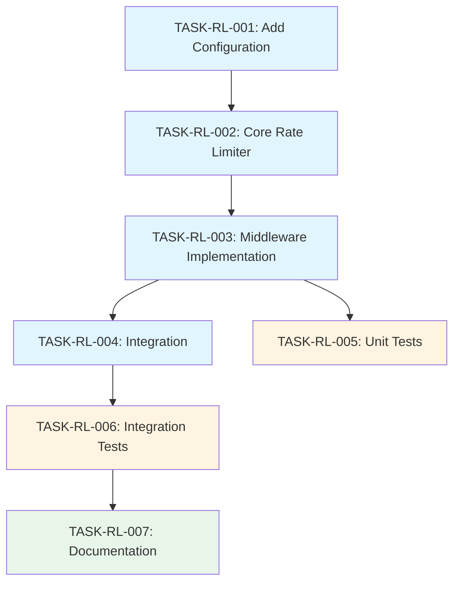

# Task Breakdown: Request Rate Limiting Implementation

## Task Metadata
- **Related RFC**: RFC-001-RATE-LIMITING
- **Priority**: P1
- **Estimated Effort**: 4-6 hours
- **Dependencies**: None

## Atomic Task List

### Task 1: Add Rate Limiting Configuration
**ID**: TASK-RL-001  
**Status**: Pending  
**Estimated Time**: 30 minutes

**Description**: Extend the configuration system to support rate limiting parameters.

**Acceptance Criteria**:
- ✅ Add `RateLimitConfig` struct to `config/config.go`
- ✅ Load configuration from environment variables with sensible defaults
- ✅ Validate configuration values (e.g., requests per second > 0)

**Files to Modify**:
- `config/config.go`
- `.env.example`

---

### Task 2: Implement Core Rate Limiter
**ID**: TASK-RL-002  
**Status**: Pending  
**Estimated Time**: 1.5 hours  
**Dependencies**: TASK-RL-001

**Description**: Create the core rate limiter using Token Bucket algorithm.

**Acceptance Criteria**:
- ✅ Create `middleware/ratelimit.go` with `RateLimiter` struct
- ✅ Implement `GetLimiter(clientID string)` method using `sync.Map`
- ✅ Implement periodic cleanup of inactive limiters (TTL: 1 hour)
- ✅ Thread-safe implementation verified by `go test -race`

**Files to Create**:
- `middleware/ratelimit.go`

---

### Task 3: Implement Rate Limiting Middleware
**ID**: TASK-RL-003  
**Status**: Pending  
**Estimated Time**: 1 hour  
**Dependencies**: TASK-RL-002

**Description**: Create HTTP middleware that enforces rate limits.

**Acceptance Criteria**:
- ✅ Extract client ID from request (IP or API Key based on strategy)
- ✅ Check rate limit using Token Bucket
- ✅ Return HTTP 429 with OpenAI-compatible error format
- ✅ Include `Retry-After`, `X-RateLimit-*` headers
- ✅ Log rate limit violations with structured logging

**Files to Modify**:
- `middleware/ratelimit.go`

---

### Task 4: Integrate Middleware into Application
**ID**: TASK-RL-004  
**Status**: Pending  
**Estimated Time**: 30 minutes  
**Dependencies**: TASK-RL-003

**Description**: Wire the rate limiting middleware into the HTTP handler chain.

**Acceptance Criteria**:
- ✅ Initialize rate limiter in `main.go`
- ✅ Insert middleware between CORS and Auth middleware
- ✅ Ensure middleware is only active when `RATE_LIMIT_ENABLED=true`

**Files to Modify**:
- `main.go`

---

### Task 5: Write Unit Tests
**ID**: TASK-RL-005  
**Status**: Pending  
**Estimated Time**: 1.5 hours  
**Dependencies**: TASK-RL-003

**Description**: Achieve >95% test coverage for rate limiting logic.

**Acceptance Criteria**:
- ✅ Test normal request flow (under limit)
- ✅ Test rate limit exceeded scenario
- ✅ Test burst handling
- ✅ Test concurrent requests with `-race` flag
- ✅ Test limiter cleanup mechanism
- ✅ Test different client ID strategies (IP vs API Key)
- ✅ Verify error response format and headers

**Files to Create**:
- `middleware/ratelimit_test.go`

---

### Task 6: Write Integration Tests
**ID**: TASK-RL-006  
**Status**: Pending  
**Estimated Time**: 1 hour  
**Dependencies**: TASK-RL-004

**Description**: Test rate limiting in realistic HTTP scenarios.

**Acceptance Criteria**:
- ✅ Test end-to-end request flow with rate limiting enabled
- ✅ Simulate burst traffic and verify 429 responses
- ✅ Verify `Retry-After` header correctness
- ✅ Test that legitimate requests are not blocked

**Files to Create/Modify**:
- Create integration test script or add to existing test suite

---

### Task 7: Update Documentation
**ID**: TASK-RL-007  
**Status**: Pending  
**Estimated Time**: 30 minutes  
**Dependencies**: TASK-RL-006

**Description**: Document the rate limiting feature for users.

**Acceptance Criteria**:
- ✅ Update `README.md` with rate limiting section
- ✅ Document all environment variables in `.env.example`
- ✅ Add usage examples and troubleshooting tips

**Files to Modify**:
- `README.md`
- `.env.example`

---

## Task Dependency Graph

## Execution Order

1. **TASK-RL-001**: Add Rate Limiting Configuration
2. **TASK-RL-002**: Implement Core Rate Limiter
3. **TASK-RL-003**: Implement Rate Limiting Middleware
4. **TASK-RL-004**: Integrate Middleware into Application
5. **TASK-RL-005**: Write Unit Tests (parallel with integration)
6. **TASK-RL-006**: Write Integration Tests
7. **TASK-RL-007**: Update Documentation

## Risk Assessment

| Risk | Probability | Impact | Mitigation |
|------|-------------|--------|------------|
| Memory leak from unlimited limiter map | Medium | High | Implement TTL-based cleanup in TASK-RL-002 |
| Performance degradation | Low | Medium | Benchmark in TASK-RL-005, use efficient sync.Map |
| False positives blocking users | Low | High | Set conservative defaults, thorough testing in TASK-RL-006 |
| Race conditions | Low | High | Use `-race` flag in all tests (TASK-RL-005) |

## Success Criteria

- ✅ All 7 tasks completed successfully
- ✅ Test coverage > 95%
- ✅ Zero data races detected by `go test -race`
- ✅ Performance overhead < 1ms per request (p99)
- ✅ Integration tests pass with burst traffic simulation
- ✅ Documentation complete and accurate